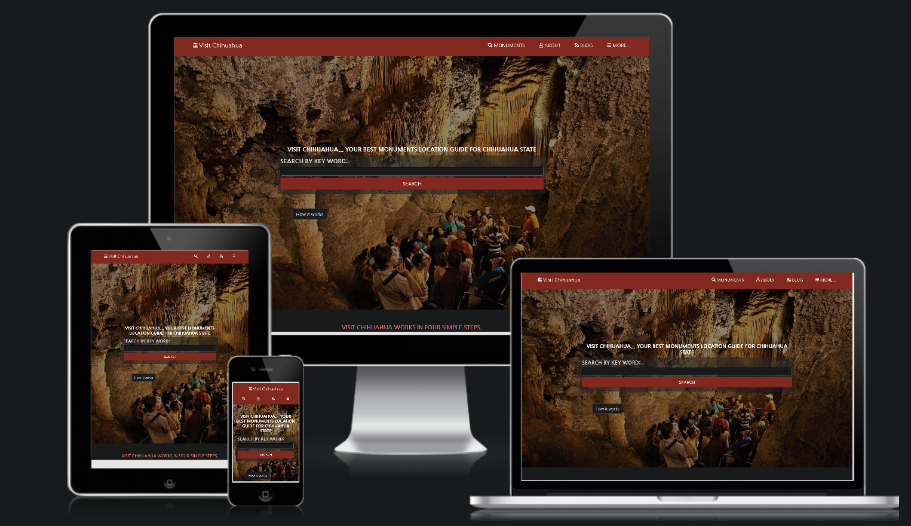

# Visit Chihuahua

The goal of this project was to apply all the previous knowledge learned like the box model, flex-boxes, grids, media queries and bootstrap while also being provided a real webpage requirement by a fictional client, we receive the general model of how the client wants it and its our work to turn it into reality with our own twist/thematic applied to it. In my case I decided to create a monument finder in my state (Chihuahua, Mexico) so people can search for a certain monument and reserve a personal tour in no time. [Visit Chihuahua](https://e71az.github.io/visit-chihuahua/)

All views:

## Demo Link

[Live Demo Link](https://e71az.github.io/visit-chihuahua/).

## Design Idea

[Mathew Njuguna and others on Behance](https://www.behance.net/mathewnjuguna).

## Built With

- HTML5
- CSS3
- Bootstrap 4

## Authors

👤 **Elias**

- Github: [@e71az](https://github.com/e71az)
- Twitter: [@e71az](https://twitter.com/e71az)
- Linkedin: [linkedin](https://www.linkedin.com/in/elias-casta%C3%B1eda-17a771115/)

## Getting Started

To get a local copy up and running follow these simple example steps.

1. Open the terminal comand line window
2. `git clone https://github.com/e71az/visit-chihuahua.git`
3. Open the index.html with your favorite browser
4. Enjoy!

## 🤝 Contributing

Contributions, issues and feature requests are welcome!

Feel free to check the [Issue page](https://github.com/e71az/visit-chihuahua/issues).

## Show your support

Give a ⭐️ if you like this project!
